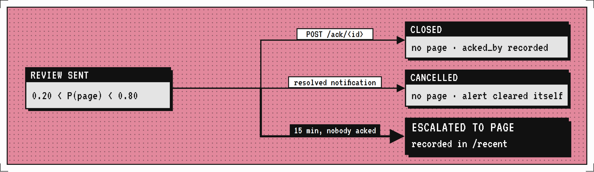

# jev-oncall

[](https://github.com/mingleiw/jev-oncall/actions/workflows/ci.yml)

Incident triage with [Jev](https://typesafe.ai), TypeSafe's System One decision model.
Each production alert gets one Jev call with four typed questions. Jev returns
probabilities, and plain code turns them into routing decisions. Jev never pages
anyone. It only judges.

**Website:** [mingleiw.github.io/jev-oncall](https://mingleiw.github.io/jev-oncall/), with an
[interactive dashboard demo](https://mingleiw.github.io/jev-oncall/demo/) and an
[architecture page](https://mingleiw.github.io/jev-oncall/architecture.html).

<video src="docs/demo.mp4" width="100%" controls></video>

That video: the [interactive demo](https://mingleiw.github.io/jev-oncall/demo/) replaying a real jev-1.13.0 run over 8 staged alerts. The triage animation reveals each judgment at the run's real per-call latency; the #5 case is the interesting one — P(page)=1.00, but Jev matches it to the checkout incident at 0.87 and routes it to human review, because the service belongs to another team. Speed numbers from a larger run are in [one measured run](#one-measured-run).

## Try it in five minutes

The demo runs Prometheus, Alertmanager, and jev-oncall together with Docker Compose.
Prometheus fires a staged incident over the first minute and Alertmanager delivers it
to jev-oncall, exactly as it would in production. You watch the decisions arrive on a
live dashboard.

### What you need

- Docker with Compose v2: Docker Desktop, or Docker Engine 24+ with the compose plugin.
  Check with `docker compose version`.
- Ports 8090, 9090, and 9093 free on your machine.
- Optionally, a TypeSafe API key from [console.typesafe.ai/keys](https://console.typesafe.ai/keys).
  The demo runs without one, but then you only see the baseline (see
  [with and without a key](#with-and-without-a-key)).

### Run it

1. **Get the code.**

   ```
   git clone https://github.com/mingleiw/jev-oncall
   cd jev-oncall/demo
   ```

2. **Add your key (optional).** Put it in `demo/.env`, which Compose reads on its own
   and git ignores:

   ```
   echo "TYPESAFE_API_KEY=<your key>" > .env
   ```

   Exporting it in your shell (`export TYPESAFE_API_KEY=...`) works too.

3. **Start the stack.** The first run builds the jev-oncall image and pulls Prometheus
   and Alertmanager, which takes a minute or two.

   ```
   docker compose up --build
   ```

4. **Open the dashboard** at <http://localhost:8090/dashboard>. Counting from when the
   containers start, the first alerts arrive within about 30 seconds and all 8 within
   a minute. The last resolve follows within two minutes. The page refreshes itself
   every 15 seconds.

5. **Stop it** with Ctrl+C, then `docker compose down`. Pending reviews are kept in a
   review store on a Docker volume, so a restart picks them up with their original
   deadlines; `docker compose down -v` clears them.

### What happens

Each alert fires at a fixed time after Prometheus starts. Alertmanager groups alerts by
service and waits 5 seconds before sending a group, so each one reaches jev-oncall a
few seconds after it fires.

| Fires at | Alert | Configured severity | What it's there to show |
| --- | --- | --- | --- |
| +10s | `OrdersDbPoolExhausted` | critical | The root cause |
| +15s | `StagingDiskFull` | critical, but `env=staging` | Non-production is logged by rule and never sent to Jev |
| +15s | `SearchApiHighMemory` | warning | Clears at +75s, and Alertmanager sends the resolve |
| +20s | `CheckoutApiErrorRate` | critical | A symptom of the database, which dedup can link to it |
| +25s | `PaymentServiceErrors` | critical | A symptom of checkout-api, one hop further downstream |
| +30s | `TlsCertExpiringSoon` | warning | Real but not urgent |
| +35s | `ReportJobSlow` | critical | Labeled critical, but the job finished and nobody was affected |
| +40s | `HomepageLatencyHigh` | warning | Labeled a warning, but checkout conversion fell 22% |

The alert text is in [demo/rules.yml](demo/rules.yml), and [demo/jev-oncall.toml](demo/jev-oncall.toml)
sets the teams and the service topology (`payment-service` → `checkout-api` →
`orders-db`) that dedup uses.

### With and without a key

**Without a key**, every alert takes the fail-open path and is routed by its
configured severity, the way it would be routed with no jev-oncall at all. The
dashboard shows 4 pages, 3 tickets, and 1 log. The three alerts from the database
incident page separately, the slow report job pages someone, and the homepage slowdown
only gets a ticket.

**With a key**, Jev judges each production alert, so compare against that baseline:

- Are `CheckoutApiErrorRate` and `PaymentServiceErrors` linked under
  `OrdersDbPoolExhausted`, so the incident pages once?
- Is `ReportJobSlow` held back from paging, and `HomepageLatencyHigh` raised?
- Which alerts land in REVIEW? Open **Why** on any alert for its probabilities and the
  reasons behind the decision.

To replay the incident, for example after adding a key, restart the stack:

```
docker compose down && docker compose up
```

### Look around

| Where | What you see |
| --- | --- |
| <http://localhost:8090/dashboard> | Every decision, grouped by outcome, with the reasons behind it |
| <http://localhost:8090/recent> | The same decisions as JSON, including reviews that escalated to a page |
| <http://localhost:8090/pending> | REVIEWs waiting on an ack, with seconds left |
| <http://localhost:9090/alerts> | Prometheus: which demo alerts are firing |
| <http://localhost:9093> | Alertmanager: groups, and what it has sent |

A REVIEW pages if nobody acks it within 15 minutes. To ack one, copy its id from
`/pending` and run:

```
curl -X POST localhost:8090/ack/<id> -H 'X-Acked-By: you'
```

`docker compose logs -f jev-oncall` shows each delivery as it arrives.

### If something goes wrong

| Symptom | Fix |
| --- | --- |
| `port is already allocated` | Something else uses 8090, 9090, or 9093. Change the left side of `ports:` in `demo/docker-compose.yml`, for example `"18090:8090"`, and open that port instead |
| `429 Too Many Requests` while pulling images | Docker Hub limits anonymous pulls. Run `docker login`, or wait and try again |
| The dashboard says 0 alerts | Wait 30 seconds. If it stays empty, `docker compose logs alertmanager` shows whether deliveries are failing |
| jev-oncall logs `POST /ingest/alertmanager ... 401` | The token in `demo/alertmanager.yml` must match `JEV_WEBHOOK_SECRET` in `demo/docker-compose.yml`. Both are `demo-secret` |
| Every alert says "Fallback: Jev unavailable" even with a key | Confirm the container received the key with `docker compose exec jev-oncall printenv TYPESAFE_API_KEY`, then check `docker compose logs jev-oncall` for the error |

### Without Docker

You need Python 3.11 or newer and nothing else. Start the server with the demo config,
send it the 14 bundled alerts, and open the same dashboard:

```
python3 server.py --config demo/jev-oncall.toml
curl -X POST localhost:8090/ingest -H 'Content-Type: application/json' -d @alerts.json
```

Then open <http://localhost:8090/dashboard>. This skips Prometheus and Alertmanager,
so every alert arrives at once instead of in sequence.

## How it works


Only step 4 leaves the server. The same flow in brief:

```
alert ──► rules ──► non-prod: LOG (no model call)
            │
            ▼
          Jev: 1 call, 4 questions ──(error / timeout / malformed)──► configured severity
            │                                                          (fail-open)
            ▼
          policy on probabilities ──► dedup graph ──► PAGE_NOW · PAGE · REVIEW · TICKET · LOG · DROP · DEDUP
```

| Question | Type | Used for |
| --- | --- | --- |
| `actionable` | Noul | Can drop an alert only when severity agrees it's noise |
| `severity` | Score: SEV4 < SEV3 < SEV2 < SEV1 | P(page) = P(SEV1) + P(SEV2) |
| `team` | Choice over your [teams](#configure-it) | Owner. Below 0.60, the runner-up team is notified too |
| `duplicate_of` | Choice over candidate alerts + `none` | Edges of the dedup graph |

### Routing policy

The thresholds are set in the `[policy]` section of the [config file](#configure-it),
with defaults in `Policy` in `triage.py`. They are starting points: tune them with
`evaluate.py --sweep` on replayed history.

| Condition | Action |
| --- | --- |
| `env` is not prod | LOG. A rule, not a model call |
| Jev error, timeout, or malformed answer | The alert's `configured_severity`: critical → PAGE, warning → TICKET, info → LOG |
| P(page) ≥ 0.80 | PAGE_NOW if P(SEV1) ≥ P(SEV2), otherwise PAGE |
| 0.20 < P(page) < 0.80 | REVIEW: low urgency, and it pages if nobody acks it within 15 minutes |
| P(page) ≤ 0.20 and P(actionable) ≤ 0.05 | DROP |
| Otherwise | TICKET |

The bars are asymmetric on purpose. DROP is the only outcome no human ever sees, so it
needs the most certainty. Being unsure costs a REVIEW, never silence. When `actionable`
and `severity` disagree, the more urgent answer wins and the disagreement is logged.

### Dedup as a graph

1. **Candidates.** `duplicate_of` offers other production alerts that started up to
   30 minutes before this one, or up to 2 minutes after (delivery jitter). If
   `topology.json` lists the alert's service, candidates are limited to that service
   and its upstream dependencies. At most 50 are offered; Choice allows 255.
2. **Edges.** An alert links to its most likely cause when that probability is at
   least 0.70 and the cause isn't itself dropped or logged.
3. **Cycles.** If alerts name each other, the loop is broken at whichever started
   first, so two alerts can never dedup each other into silence.
4. **Clusters.** Each cluster's root gets the most urgent action of any member.
   Members owned by the root's team are DEDUPed. A member owned by another team that
   would have paged gets a REVIEW instead, so a wrong link can delay another team by
   the ack window but never silence it.

`check_invariants()` exits the run with status 1 if a linked alert's root is less
urgent than the alert itself, or if anything was dropped without a model judgment.

### Failure handling

- The model is pinned to `jev-1.13.0`, not `jev-latest`. An alias moves when
  TypeSafe ships a release, which can shift probabilities under the thresholds.
  Re-run the sweep before moving the pin. A warning prints if Jev answers as a
  different version.
- Each call gets a 2-second timeout and one retry. A retry that would wait more than
  1 second falls back instead: on a paging path, falling back beats waiting.
- Every call carries one `Idempotency-Key`, reused by its retry. A client-side
  timeout does not mean Jev failed to answer, so retrying under a fresh key would
  judge the alert twice and be billed twice.
- `results.json` keeps every raw probability, so any decision, including every DROP,
  can be audited and re-routed offline.

### Hardening

- **Connection pooling.** `triage.py` keeps a thread-safe pool of `HTTPSConnection`
  objects (up to 16) with keep-alive, avoiding a TLS handshake on every Jev call.
  Connections are returned to the pool on success and discarded on error.
- **Response validation.** Probabilities are checked for NaN and Inf. Choice answers
  (`team`, `duplicate_of`) are verified to match the max-probability entry in their
  distribution. Malformed answers trigger fail-open.
- **Rate limiting.** The webhook server enforces a sliding-window rate limit (default
  120 requests per minute, configurable with `--rate-limit`). Excess requests get a
  429 response.
- **Input validation.** `validate_alert()` enforces non-empty `id` and `title`,
  clamps field lengths, normalizes unknown severities to `critical`, and replaces
  malformed timestamps with the current time.
- **Alert staleness.** Active alerts older than one hour are pruned from the server's
  in-memory set, preventing unbounded memory growth on long-running instances.
- **Backoff.** Retries use escalating `0.5 * 2^attempt` delays. 429 responses honor
  the `Retry-After` header when present.

## Evaluating it

The 14 synthetic alerts in `alerts.json` are a smoke test, not an evaluation. At that
size, the 11/12 severity agreement has a 95% interval of roughly 65 to 99%, and
calibration, which every threshold depends on, can't be measured at all.

The smoke test has a second limit. The alert titles start with Firing, Warning, or
Info, and routing on that configured severity alone already matches every label
except the two duplicates. So this set can only show what Jev adds through dedup.
Real alert streams have noisier configured severities, and measuring that gap is what
a replay is for.

Replay a few hundred historical alerts, labeled with the severity assigned after
each incident:

```
python3 triage.py --alerts history.jsonl --out replay.json --timeout 10 --retries 3 --max-wait 30
python3 evaluate.py replay.json --sweep
```

`evaluate.py` makes no API calls. It reports:

- **Outcomes that matter on-call:** silent misses; missed, delayed, false, and
  duplicate pages; pages to the wrong team; wrong incident links; review and ticket
  load. These appear side by side with **your current routing**: every alert routed by
  its configured severity alone (critical pages, warning tickets, info logs, in every
  environment). Shadow mode compares against the same baseline, so the page counts
  agree. Outcome rows count labeled alerts; pages and reviews sent count every alert.
- **Per-question agreement** with Wilson 95% intervals.
- **Calibration:** Brier score, ECE, and a reliability table for P(page) and
  P(actionable).
- **`--sweep`:** re-routes the stored answers under other thresholds, so you can
  choose them from data.

### Benchmarking latency

Latency is the one thing measurable without labeled history. `generate_alerts.py`
writes synthetic alerts — incident clusters with a root cause and downstream
alerts, plus noise — carrying no `expected` labels, because they measure how fast
triage runs, not how well it judges.

```
python3 generate_alerts.py --count 300 --out bench_alerts.json
python3 triage.py --alerts bench_alerts.json --out bench_results.json
python3 generate_dashboard.py bench_results.json --alerts bench_alerts.json \
  --out bench_dashboard.html --label "Synthetic benchmark"
```

The run prints per-call p50/p95/p99 and total cost, and `bench_results.json`
stores them under `summary`. Latency depends on your network path to the API, so
the number is yours, not a published claim.

#### One measured run

300 synthetic alerts, 16 workers, default 2-second timeout. 233 reached Jev; the
other 67 were non-prod and never called the model.

| | |
| --- | --- |
| Per-call latency | min 204ms, p50 418ms, p90 674ms, p95 1477ms, p99 1748ms, max 1849ms |
| Wall clock | 7,642ms for all 300 |
| Cost | $0.0128 total, about $0.04 per 1,000 alerts |
| Payload | 304,175 input tokens, ~1,305 per call |
| Fallbacks | 0 |

Two things in that run matter more than the median.

**The tail nearly reaches the timeout.** The slowest call took 1,849ms against a
2,000ms limit — 151ms of margin. Nothing fell back this time, but a slower
network path would push the top of the distribution over the line, and those
alerts would route on configured severity instead. Latency between p90 and p95
jumps 2.2x, so the tail is where the risk lives, not the middle. Raise
`--timeout` or accept that the fail-open path is load-bearing.

**37% of judged alerts landed in REVIEW.** 86 of 233 fell between the 0.20 and
0.80 bars. That is the band working as designed, but it is also a lot of human
attention, and it says the default bars are wide for this alert mix. Tuning them
is what `evaluate.py --sweep` is for.

Both numbers come from one machine on one network path against synthetic alerts.
They say nothing about whether the routing was correct.

Accuracy and calibration are not measurable this way. Synthetic alerts carry the
author's guesses as labels, which is the same circularity the smoke test has. Use
replayed history for those.

Alert format (JSON list or JSONL):

```json
{"id": "a01", "title": "...", "description": "...", "service": "checkout-api",
 "env": "prod", "started_at": "2026-09-18T14:03:00Z", "configured_severity": "critical",
 "expected": {"actionable": true, "severity": "SEV1", "team": "deploy", "duplicate_of": null}}
```

`expected` is optional and only used for evaluation.

## Configure it

Your teams, thresholds, and service topology live in one TOML file, so you can
adopt jev-oncall without editing its code. Start from the example, which lists every
key with its default:

```
cp jev-oncall.example.toml jev-oncall.toml
python3 triage.py --config jev-oncall.toml
python3 server.py --config jev-oncall.toml     # or: export JEV_ONCALL_CONFIG=jev-oncall.toml
```

| Section | What it sets |
| --- | --- |
| `[jev]` | Pinned model, per-call timeout, retries, longest backoff |
| `[policy]` | Every routing threshold, the review ack window, and the fallback owner |
| `[teams]` | `name = "what it owns"`, 2 to 255 teams. Jev picks the owner from these descriptions, so write them the way you'd brief a new on-call engineer |
| `[topology]` | `service = ["upstream", ...]`, used to narrow dedup candidates |
| `[shadow]` | `log = "shadow.jsonl"` turns on [shadow mode](#shadow-mode) |
| `[server]` | `require_token = true` makes `/ack` and `/label` require the webhook secret as a bearer token ([details](#acting-from-the-dashboard)) |
| `[reviews]` | `store = "reviews.jsonl"` keeps reviews on disk so they survive a restart ([the review clock](#the-review-clock)) |

Every section is optional, and anything left out keeps its default. The file is
checked strictly: an unknown key, a threshold outside 0 to 1, or a `no_page_bar`
at or above `page_bar` stops the program before it triages anything, because a typo
that silently kept a default would change who gets paged. Command-line flags
(`--model`, `--timeout`, `--retries`, `--max-wait`, `--topology`) override the file.
Secrets stay in environment variables and never go in the file.

The config's teams and thresholds are written into `results.json`, so `evaluate.py`
and the dashboard judge a run by the policy it actually ran with.

## Run it

Python 3.11 or newer, standard library only.

```
export TYPESAFE_API_KEY=<your key from console.typesafe.ai/keys>
python3 triage.py          # routing table + results.json, plus the evaluation if alerts are labeled
python3 triage.py --config jev-oncall.toml   # with your teams and thresholds
python3 triage.py -v       # also prints the reasons behind every decision
python3 generate_dashboard.py   # dashboard.html from results.json
python3 -m unittest -v     # offline tests with a fake Jev: no key, no network
```

## Webhook server

`server.py` is an HTTP adapter that receives alerts from monitoring systems,
normalizes them into the `alerts.json` schema, triages with Jev, and returns
decisions as JSON. Standard library only.

```
export TYPESAFE_API_KEY=<your key from console.typesafe.ai/keys>
python3 server.py                           # localhost:8090
python3 server.py --host 0.0.0.0 --port 9000
```

### Docker

```
docker build -t jev-oncall .
docker run -p 8090:8090 -e TYPESAFE_API_KEY -e JEV_WEBHOOK_SECRET \
  -v $PWD/jev-oncall.toml:/config/jev-oncall.toml -e JEV_ONCALL_CONFIG=/config/jev-oncall.toml \
  jev-oncall
```

The image is `python:3.12-slim` plus the scripts: no dependencies to install. It
runs as a non-root user and has a health check on `/health`.

### Endpoints

| Method | Path | Description |
| --- | --- | --- |
| POST | `/ingest/<provider>` | Receive a webhook. Providers: `alertmanager`, `datadog`, `pagerduty`, `grafana`, `generic` |
| POST | `/ingest` | Same as `/ingest/generic` |
| POST | `/ack/<alert-id>` | Ack a REVIEW so it does not page. `X-Acked-By` names who took it |
| GET | `/health` | `{"ok": true}` |
| GET | `/recent` | Last 200 triage decisions (in-memory ring buffer) |
| GET | `/pending` | REVIEWs still waiting on an ack, with seconds left and deadline, plus recently closed ones and how they closed |
| GET | `/dashboard` | The last 500 alerts as the HTML dashboard, refreshing every 15 seconds. Each shows the decision it got on arrival and, for a review, where it stands now |
| POST | `/label/<alert-id>` | [Shadow mode](#shadow-mode): record what an alert really was. `X-Labeled-By` names who labeled it |
| GET | `/shadow` | [Shadow mode](#shadow-mode): how decisions compare with routing by configured severity |

### The review clock



A REVIEW is only meaningful if something escalates it. The server holds every
REVIEW for `Policy.review_ack_min` (15 minutes), and it ends one of three ways:

- **Acked** (`POST /ack/<id>`): someone is on it. The review closes and won't
  escalate. An ack doesn't resolve anything: the alert stays open until your
  monitoring clears it.
- **Cancelled**: the provider says the alert resolved before anyone acked, so no
  page is needed.
- **Escalated**: nobody acked in time. A sweeper turns it into a PAGE, records it in
  `/recent` with the reason, and counts it under `escalated_reviews`.

```
curl -X POST http://localhost:8090/ack/a07 -H 'X-Acked-By: alice'
curl http://localhost:8090/pending
```

Acking a review that already closed returns 409 with how it closed. The same alert
sent again keeps its first deadline, so resends can't push the page back, and a
closed review stays closed: until the alert resolves, or for an hour, another REVIEW
for it is a duplicate.

"Pages" here are decisions jev-oncall records. Delivering them to PagerDuty, Slack
or Jira isn't built yet; read them from `/recent`, `/pending` and the dashboard.

**Surviving restarts.** Set a review store:

```toml
[reviews]
store = "reviews.jsonl"      # or: python3 server.py --review-store reviews.jsonl
```

Every open, ack, cancellation and escalation is appended to that file and flushed to
disk before it counts. On startup the server replays it: pending reviews come back
with their original deadlines, any whose deadline passed while it was down page
immediately, acked and cancelled reviews stay closed, and an escalation already
recorded is never repeated. The file is compacted on startup to pending reviews plus
the last week of closed ones. Without a store, reviews live in memory, a restart
drops them, and the server warns at startup.

Supported: one server process per store file, on local disk (in Docker, a volume).
Not supported: several servers sharing a store, or a network filesystem. Decisions
and labels in the dashboard's last 500 alerts are in memory too; the shadow log
keeps them across restarts. `--sweep-interval` controls how often deadlines are
checked (default 10 seconds).

### Shadow mode

Shadow mode is how a team tries jev-oncall before trusting it. Run it next to
your existing paging, point your alerts at both, and it records what it would
have done. It never sends anything onward. Once outbound paging exists, shadow
mode will keep it switched off.

```
python3 server.py --config jev-oncall.toml --shadow-log shadow.jsonl
```

or set `[shadow] log = "shadow.jsonl"` in the config. Every decision goes to that
append-only JSONL file next to a **baseline**: the action routing by configured
severity takes, which is what most paging setups do today and exactly what
jev-oncall's fail-open path computes. Review outcomes (acked, escalated, cancelled
by a resolve) are logged too. The file survives restarts; in Docker, put it on a
volume.

`GET /shadow` summarizes the log: how many alerts matched your current routing,
and each kind of difference, with the latest differences and their reasons.

| Difference | What it means |
| --- | --- |
| Would page, your routing didn't | jev-oncall pages an alert configured as a warning or info |
| Would ask for a review, your routing didn't page | An unsure alert gets a person's attention instead of a ticket |
| Your routing paged, would ask for a review instead | Unsure: a person decides within 15 minutes, or it pages |
| Your routing paged, would fold into an incident that already pages | A duplicate page saved |
| Your routing paged, would not page | Held back, for example a non-production alert or one Jev judged minor |
| Would drop, nobody sees it | The only silent outcome. Check these first |

Differences only say where jev-oncall and your routing disagree, not which one was
right. For that, label alerts after the fact, for example in an incident review:

```
curl -X POST localhost:8090/label/<alert-id> -H 'X-Labeled-By: alice' \
  -d '{"severity": "SEV2", "actionable": true, "team": "database", "duplicate_of": null}'
```

`severity` and `actionable` are required. `team` must be one of your teams, and
`duplicate_of` is the alert that caused this one, if any. Then score the log the same
way as a replay, side by side with the baseline, including the threshold sweep:

```
python3 evaluate.py --shadow shadow.jsonl --sweep
```

Only labels posted to `/label` count; an `expected` block inside a webhook payload
is ignored. Like `/ack`, `/label` is open by default; see
[Acting from the dashboard](#acting-from-the-dashboard) to require a token.

### Acting from the dashboard

The live dashboard (`/dashboard`) is where people act, so nobody needs `curl`:

- **Reviews waiting for an ack** lists every open REVIEW with its clock counting
  down and an **Ack** button, then the reviews that closed and how: acked by whom,
  cleared, or paged. Each alert keeps the decision it got on arrival (**Sent to
  review**) and shows where its review stands now beneath it.
- **Compared with your current routing** (shadow mode) shows the counts above, the
  pages each side would have sent, and the latest differences, drops first.
- **What was this really?** (shadow mode) sits in each alert's **Why** panel: pick a
  severity, whether it needed a human, the owner, and the alert that caused it, if
  any, from the alerts received. Saving again replaces the label. Saved labels show
  on the alert and the page re-scores **Against the labels** right away.

After an Ack or a label, and every 15 seconds, the page re-renders from the server in
place, keeping your scroll position, open **Why** panels and focus. It skips a refresh
while you're typing or have a label half filled in.

To see it without running anything, open the
[interactive demo](https://mingleiw.github.io/jev-oncall/demo/): the Docker demo's
incident, with the judgments replayed from a real jev-1.13.0 run instead of calling Jev. The first time you act, the page
loads this repository's Python in your browser with [Pyodide](https://pyodide.org)
and runs the real review queue, routing and evaluation on a demo clock. Besides Ack
and labels, it can advance the clock 15 minutes (unacked reviews page), simulate a
Jev timeout (a new alert falls back to its configured severity) and clear an alert
before its deadline (its review is cancelled). Nothing leaves your browser; what you
did is kept there until **Start over**. `python3 build_demo.py` rebuilds it into
`docs/demo/`, and a test fails if the published copy is stale.

Type your name once at the top; it's remembered in your browser and recorded on
acks and labels.

`/ack` and `/label` are open by default. To require a token, set

```toml
[server]
require_token = true
```

with `JEV_WEBHOOK_SECRET` set; the server refuses to start without it. Either way,
requests a browser makes from another site are refused, so a page elsewhere can't
ack a review behind your back. Both endpoints
then need `Authorization: Bearer <JEV_WEBHOOK_SECRET>`, and the dashboard shows a
**Token** field. Reading `/dashboard`, `/recent` and `/shadow` stays open, so keep the
server on a network you trust either way. Config itself is never editable from the
page: it stays a file you review like code.

### Signing webhooks

Set `JEV_WEBHOOK_SECRET` and every ingest must carry an HMAC-SHA256 of the raw
body. Without it the server starts, warns, and accepts anything: unsigned ingest
lets anyone who can reach the port inject a page, or inject an alert crafted to
be chosen as a real incident's `duplicate_of` root and dedup that page into
silence.

| Provider | Header | Format |
| --- | --- | --- |
| `pagerduty` | `X-PagerDuty-Signature` | `v1=<hex>`, comma-separated during key rotation. Non-`v1` elements are ignored, never trusted |
| `grafana` | `X-Grafana-Alerting-Signature` | bare hex. Grafana's optional timestamped variant is not supported |
| `datadog`, `generic` | `X-Jev-Signature` | `sha256=<hex>` or bare hex, set as a custom header on the outgoing webhook |
| `alertmanager` | `Authorization` | `Bearer <secret>`. Alertmanager can't compute an HMAC, so the secret itself is the credential: it authenticates the sender, not the body, so serve it over TLS |

### Providers

**Alertmanager** (Prometheus) takes the standard v4 webhook. Point a receiver at
the server:

```yaml
receivers:
  - name: jev-oncall
    webhook_configs:
      - url: https://jev-oncall.internal:8090/ingest/alertmanager
        send_resolved: true
        http_config:
          authorization:
            credentials: <same value as JEV_WEBHOOK_SECRET>
```

The title is `alertname: summary`. The `description` annotation, the remaining
labels, and the `generatorURL` go into the description, so Jev sees the instance
and job. Service comes from the `service`, `job`, or `namespace` label, env from `env`
or `environment` (default `prod`), and severity from the `severity` label:
`critical`/`page`/`error` → critical, `warning` → warning, `info`/`none` → info, and
anything else pages.

Two Alertmanager behaviors need handling, and both are covered:

- **Group resends.** Alertmanager re-sends every alert in a group whenever the group
  changes. An alert already judged comes back under `repeats` and isn't judged or
  routed again. Each firing gets one id, from its fingerprint and `startsAt`, so
  a later re-fire of the same labels is judged fresh. A REVIEW also keeps its first
  deadline if the same alert is reviewed again, so no provider's resends can push a
  page back indefinitely.
- **Resolved notifications.** With `send_resolved: true`, a resolved alert is
  never triaged. If its REVIEW is still waiting on an ack, the review is cancelled
  and reported under `reviews_cancelled`, with `cancelled_by: resolved upstream` (a
  cancellation, not an ack): an alert that
  cleared on its own shouldn't page anyone. It stays a dedup candidate until it ages
  out, because things it caused can still arrive. Grafana resolved notifications get
  the same treatment.

**Generic** accepts the jev-oncall alert schema directly (`{id, title, description,
service, env, started_at, configured_severity}`), so any system can integrate by
posting normalized JSON.

**Datadog** maps monitor webhooks. Service and env are extracted from tags
(`service:X`, `env:Y`). Priority P1-P2 → critical, P3 → warning, P4-P5 → info.

**PagerDuty** handles v2 and v3 webhook subscriptions. Urgency high → critical,
low → warning. The `severity` field, if present, takes precedence.

**Grafana** handles both legacy and Unified Alerting webhooks. Severity is read
from the `severity` or `priority` label. Service is read from `service`, `job`,
or `namespace` labels.

Each provider generates a stable deterministic alert ID from `sha256(provider:raw_id)`,
so the same upstream alert always maps to the same triage ID.

### Example

```bash
curl -X POST http://localhost:8090/ingest/datadog \
  -H 'Content-Type: application/json' \
  -d '{"id": 12345, "title": "CPU > 90%", "tags": "service:api,env:prod", "priority": "P1"}'
```

The dashboard is one self-contained HTML file. It opens with a sentence saying what
paged someone and what is waiting for a human. Below that, every judged alert sits as
a dot on a P(page) scale, drawn against the policy's 0.20 and 0.80 bars. Alerts are
then grouped by outcome, with linked alerts nested under the incident they joined and
a "Why" panel holding each decision's reasons and raw probabilities. It ends with run
facts and, when alerts are labeled, the same outcomes, agreement, and calibration
numbers `evaluate.py` prints. It follows the system's light or dark setting.

Without a key, every alert takes the fail-open path, which shows the static baseline.
Standard library only.

## Development

```bash
python3 -m unittest test_triage test_server test_dashboard test_config test_shadow test_live -v   # all offline tests
python3 -m unittest test_triage -v                              # triage engine only
python3 -m unittest test_server -v                              # webhook adapter only
```

Tests use a fake Jev that returns canned probabilities. No API key, no network.

Want to help? [CONTRIBUTING.md](CONTRIBUTING.md) covers setup, the rules that keep
paging safe, and how to add a provider. The
[good first issues](https://github.com/mingleiw/jev-oncall/issues?q=is%3Aopen+label%3A%22good+first+issue%22)
are a good place to start.

## Files

| File | Job |
| --- | --- |
| [triage.py](triage.py) | Jev calls, routing policy, dedup graph, fallback, invariants |
| [evaluate.py](evaluate.py) | Offline outcomes, agreement, calibration, threshold sweep |
| [generate_dashboard.py](generate_dashboard.py) | Renders `results.json` as `dashboard.html` |
| [generate_alerts.py](generate_alerts.py) | Synthetic alerts for latency benchmarking (no labels) |
| [server.py](server.py) | Webhook adapter for Alertmanager, Datadog, PagerDuty, Grafana, and generic alerts, plus a live dashboard |
| [Dockerfile](Dockerfile) | Image for the webhook server |
| [docs/](docs) | The website, served by GitHub Pages: `index.html`, `architecture.html`, and the images the README shows |
| [demo/](demo) | Docker Compose demo: Prometheus, Alertmanager, and jev-oncall |
| [test_triage.py](test_triage.py) | Triage engine tests with a fake Jev |
| [test_server.py](test_server.py) | Webhook adapter tests (normalizers, validation, HTTP) |
| [test_dashboard.py](test_dashboard.py) | Dashboard rendering tests |
| [test_config.py](test_config.py) | Config loading, validation, and precedence tests |
| [shadow.py](shadow.py) | Shadow mode: the decision log, the comparison with configured-severity routing, and the input `evaluate.py --shadow` scores |
| [test_shadow.py](test_shadow.py) | Shadow mode tests: comparisons, labels, the log, the endpoints |
| [build_demo.py](build_demo.py) | Builds the interactive dashboard demo in `docs/demo/` from the Docker demo's incident, with the judgments replayed from a real jev-1.13.0 run, and copies the modules the browser runs to `docs/demo/engine/` |
| [test_live.py](test_live.py) | Live dashboard tests: the review queue, the shadow comparison, label forms, the token option |
| [test_reviews.py](test_reviews.py) | The review clock end to end: acks, cancellations, escalation, duplicate deliveries, restart recovery, labels, baselines, and the demo engine |
| [jev-oncall.example.toml](jev-oncall.example.toml) | Every setting with its default: teams, thresholds, topology, Jev call limits |
| [alerts.json](alerts.json) | 14 synthetic alerts with the author's labels |
| [topology.json](topology.json) | Service → upstream dependencies, used when the config has no `[topology]` |
| `results.json`, `dashboard.html` | Written by `triage.py` and `generate_dashboard.py` |
