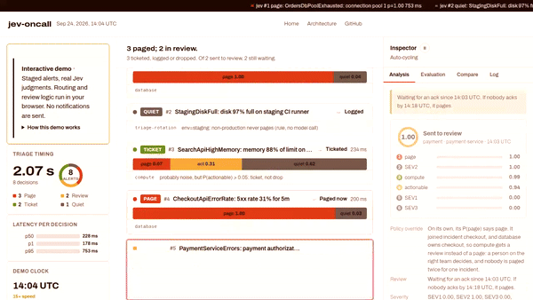
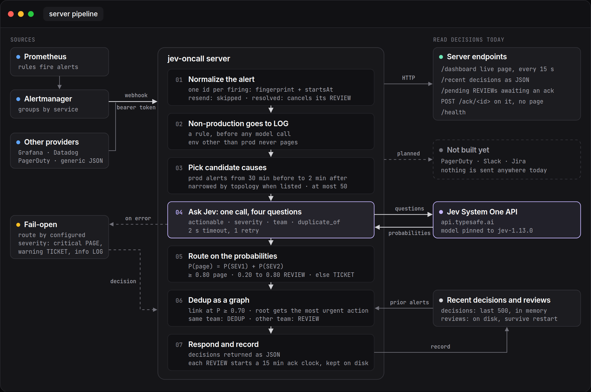

# jev-oncall

[](https://github.com/mingleiw/jev-oncall/actions/workflows/ci.yml)

Open-source alert triage with [Jev](https://typesafe.ai), TypeSafe's System One decision model.
Each production alert gets one Jev call with four typed questions. Jev returns
probabilities, and plain, auditable code turns them into routing decisions. Jev never
pages anyone. It only judges.

**[Live demo](https://mingleiw.github.io/jev-oncall/demo/)** ·
[Website](https://mingleiw.github.io/jev-oncall/) ·
[Architecture](https://mingleiw.github.io/jev-oncall/architecture.html)



The demo replays a real jev-1.13.0 run over 8 staged alerts. Watch alert #5: P(page)
is 1.00, but Jev links it to the checkout incident, which another team owns, so it goes
to human review instead of paging a second team.

## Try it in five minutes

The demo runs Prometheus, Alertmanager and jev-oncall with Docker Compose. Prometheus
fires a staged incident over the first minute, Alertmanager delivers it to jev-oncall,
and you watch the decisions arrive on a live dashboard.

You need Docker with Compose v2 (Docker Desktop, or Docker Engine 24+; check with
`docker compose version`) and ports 8090, 9090 and 9093 free. A TypeSafe API key
from [console.typesafe.ai/keys](https://console.typesafe.ai/keys) is optional: without
one, every alert is routed by its configured severity, which shows the baseline.

```
git clone https://github.com/mingleiw/jev-oncall
cd jev-oncall/demo
echo "TYPESAFE_API_KEY=<your key>" > .env    # optional; git ignores .env
docker compose up --build
```

Open <http://localhost:8090/dashboard>. All 8 alerts arrive within a minute:

| Alert | Configured | What it's there to show |
| --- | --- | --- |
| `OrdersDbPoolExhausted` | critical | The root cause |
| `StagingDiskFull` | critical, `env=staging` | Non-production is logged by rule and never sent to Jev |
| `SearchApiHighMemory` | warning | Clears after a minute, and Alertmanager sends the resolve |
| `CheckoutApiErrorRate` | critical | A symptom of the database |
| `PaymentServiceErrors` | critical | A symptom of checkout, one hop further downstream |
| `TlsCertExpiringSoon` | warning | Real but not urgent |
| `ReportJobSlow` | critical | Labeled critical, but the job finished and nobody was affected |
| `HomepageLatencyHigh` | warning | Labeled a warning, but checkout conversion fell 22% |

Stop with Ctrl+C, then `docker compose down`. What to look for, troubleshooting, and
running without Docker are in [guide/demo.md](guide/demo.md).

## How it works



Jev answers four questions about each production alert:

| Question | Used for |
| --- | --- |
| `actionable` | Dropping an alert, only when severity agrees it's noise |
| `severity` (SEV1 to SEV4) | P(page) = P(SEV1) + P(SEV2) |
| `team` | The owner, from your configured teams |
| `duplicate_of` | Linking symptoms to the incident that caused them |

Code then decides:

| Condition | Action |
| --- | --- |
| Not production | LOG, by rule, with no model call |
| Jev error or timeout | Route by configured severity (fail-open) |
| P(page) ≥ 0.80 | PAGE (PAGE_NOW when SEV1 is the likelier) |
| 0.20 < P(page) < 0.80 | REVIEW: pages if nobody acks within 15 minutes |
| P(page) ≤ 0.20 | TICKET, or DROP only when P(actionable) ≤ 0.05 too |

Being unsure costs a human's attention, never silence. Linked alerts join one incident
that pages once, but a link can never silence another team: it gets a REVIEW instead.
Details, including the dedup graph and failure handling, are in
[guide/design.md](guide/design.md).

## Use it with your alerts

Python 3.11+, standard library only, or the Docker image.

```
cp jev-oncall.example.toml jev-oncall.toml     # your teams, thresholds and topology
export TYPESAFE_API_KEY=<your key>
export JEV_WEBHOOK_SECRET=<a shared secret>    # signs incoming webhooks
python3 server.py --config jev-oncall.toml     # listens on localhost:8090
```

Point Alertmanager, Datadog, PagerDuty or Grafana at `/ingest/<provider>`, or post
normalized JSON to `/ingest`. The dashboard is at `/dashboard`.

**Try it in shadow mode first.** Add `--shadow-log shadow.jsonl` and jev-oncall records
what it would have done next to what your current routing did, without sending
anything. Label alerts after incidents, then score it with
`python3 evaluate.py --shadow shadow.jsonl --sweep`.

**Not built yet:** delivering pages to PagerDuty, Slack or Jira. Today, decisions are
read from `/recent`, `/pending` and the dashboard.

[guide/server.md](guide/server.md) covers configuration, every endpoint, the review
clock, shadow mode, webhook signing and each provider's mapping.
[guide/evaluation.md](guide/evaluation.md) covers replaying labeled history, choosing
thresholds, and a measured latency run.

## Development

```
python3 -m unittest test_triage test_server test_dashboard test_config test_shadow test_live test_reviews
```

Tests use a fake Jev with canned probabilities: no API key, no network.
[CONTRIBUTING.md](CONTRIBUTING.md) covers setup, the rules that keep paging safe, and
how to add a provider. The
[good first issues](https://github.com/mingleiw/jev-oncall/issues?q=is%3Aopen+label%3A%22good+first+issue%22)
are a good place to start.

| File | Job |
| --- | --- |
| [triage.py](triage.py) | Jev calls, routing policy, dedup graph, fallback, invariants |
| [server.py](server.py) | Webhook server: providers, review clock, live dashboard |
| [shadow.py](shadow.py) | Shadow mode: the decision log and the comparison with your routing |
| [evaluate.py](evaluate.py) | Offline outcomes, agreement, calibration, threshold sweep |
| [generate_dashboard.py](generate_dashboard.py) | Renders decisions as the HTML dashboard |
| [jev-oncall.example.toml](jev-oncall.example.toml) | Every setting with its default |
| [build_demo.py](build_demo.py) | Builds the interactive demo in `docs/demo/` |
| [demo/](demo) | The Docker Compose demo |
| [docs/](docs) | The website, served by GitHub Pages |
