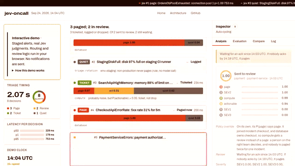
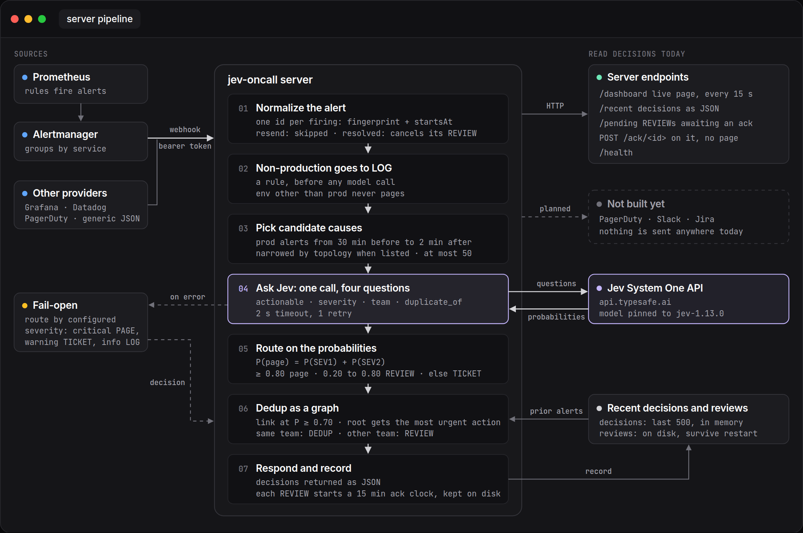

# jev-oncall

[](https://github.com/mingleiw/jev-oncall/actions/workflows/ci.yml)

On-call tooling built on [Jev](https://typesafe.ai), TypeSafe's System One decision model,
with one rule throughout: **the model judges, plain code decides.** Jev answers narrow,
typed questions with probabilities; auditable code turns them into actions.

Two parts:

- **[Root-cause analysis](#root-cause-analysis)** (current focus): can Jev find why an
  outage happened, with no general-purpose LLM in the loop? An open benchmark on
  recorded incidents and on outages adapted from public postmortems, with every trace
  committed.
- **[Alert triage](#alert-triage)**: route each production alert (page, review, ticket
  or drop) and link symptoms to their cause. A working server with a live demo.

## Root-cause analysis

When something breaks, the first suspect (a recent deploy, an apparent attack, a
provider outage) is often wrong, and investigators anchor on it. The benchmark gives an
investigator a frozen incident, a list of hypotheses and a menu of diagnostic checks.
It runs checks one at a time and names the cause. Answers live in truth files the
investigator never sees.

Three ways to investigate the same incidents:

| Setup | Who picks checks and names the cause |
| --- | --- |
| `alone` | An LLM |
| `jev` | An LLM, shown Jev's scores of every hypothesis after each check |
| `jev-agent` | **Jev and code, no LLM.** Jev answers bounded questions (which hypothesis the evidence supports, which check next, whether each alternative is ruled out); code picks the action, enforces budgets, and verifies before stopping |

### Results on recorded incidents

The main test. It uses 60 faults recorded in two microservice systems: Sock Shop and
Train Ticket, from [RCAEval](https://github.com/phamquiluan/RCAEval), RE2 instance 1.

- **Generated, not written.** Code built each incident's suspects and checks from the
  recorded telemetry; nothing was written by hand.
- **Frozen first.** The scenarios were committed before the first trial, and Jev's
  rules were frozen at v5.
- **Conditions:** free choice of checks, at most 8, one trial per case.

| | Right service | Supported diagnosis | Checks | Seconds per case | LLM calls |
| --- | --- | --- | --- | --- | --- |
| DeepSeek V4.1 Flash alone | 53/58 | 39/58 | 6.5 | 32 | yes |
| GLM-5.3 alone | 52/54 | 41/54 | 6.6 | 119 | yes |
| **Jev investigates (no general-purpose LLM)** | **57/60** | **35/60** | **7.6** | **5.3** | **0** |

- **Jev found the right service as often as the LLMs.** On the 52 cases all three
  completed: Jev 51, DeepSeek 48, GLM 50. It was 6–22× faster, at about $0.004 per
  case in Jev calls.
- **Every answer it marked verified was right:** 9 of 9. Its 3 wrong answers were all
  marked unverified.
- **Its weak spot is evidence.** In 22 of its right answers, it cited checks, but none
  for the injected fault type (for example, the CPU check for a CPU fault). The LLMs
  cited the right kind of evidence more often.
- **Infrastructure failures are excluded from every rate:** 2 for DeepSeek (timeouts),
  and 6 for GLM (1 timeout and 5 hits on the provider's credit cap).

Limits: these are staged faults in demo systems, one cause each, and the suspects are
services. [guide/rca-recorded.md](guide/rca-recorded.md) has the design, the
preregistration and the commands. The traces are in
[rca_results/2026-09-29-recorded-test/](rca_results/2026-09-29-recorded-test).

### Results on hand-written scenarios

Five outages adapted from public postmortems (Cloudflare ×2, Roblox, Datadog, Slack),
free choice of checks, at most 6 per trial, 25 trials per system:

| | Correct cause | Supported diagnosis | Checks | Seconds per trial | LLM calls |
| --- | --- | --- | --- | --- | --- |
| DeepSeek V4.1 Flash alone | 25/25 | 23/25 | 4.8 | 89 | ≥5.8 |
| DeepSeek + Jev | 24/24 | 24/24 | 3.9 | 88 | ≥4.9 |
| GLM-5.3 alone | 25/25 | 25/25 | 4.2 | 84 | ≥5.2 |
| GLM-5.3 + Jev | 25/25 | 25/25 | 3.8 | 137 | ≥4.8 |
| **Jev investigates (no general-purpose LLM)** | **25/25** | **25/25** | **4.2** | **2.8** | **0** |

The Jev row is policy v5, the current default (`rca_results/2026-09-29-jev-agent-v5/`).

- **Jev alone** matched the LLMs: 25/25. It was about 30× faster than the LLMs alone
  (0.27 s per decision against 15–16 s) and cost about $0.0008 per trial in Jev calls.
  It cited no failed or empty query as evidence.
- **Every answer it marked verified was right**: 23 of 23 across the hard set and the
  three hand-written scenarios. Verified means every alternative that ever looked
  plausible was ruled out by a specific result. Unverified doesn't mean wrong: all 17
  unverified answers were also right. In host_patch_routes, for example, the network
  plugin can't be fully ruled out from the checks available.
- **Hand-written scenarios**: 15/15 correct (6 verified).
- **Helping an LLM**, Jev cut checks by 10–19% at the same accuracy.

"Supported diagnosis" is scored on check IDs, the same way for every setup: the right
cause, citing only checks actually run, no failed query, and at least one check that
shows the mechanism. LLM calls are lower bounds: those runs predate call counting.

**Limits.** The telemetry is written, not recorded, and each scenario has one cause.
There are two LLM baselines so far, both on free tiers. Jev's decision rule was revised
after seeing results:

- **v2:** v1 abstained too often.
- **v3:** v2's "verified" was too loose.
- **v4:** added a check that challenges the leading suspect.
- **v5:** fixed a v4 bug that had weakened verification.

Because of those revisions, none of the eight scenarios is held out any more. The next
real test is incidents Jev hasn't seen. Traces for every version, including the failed
ones, are in [rca_results/](rca_results).

### Run it

```
python3 rca_experiment.py --dry-run --setup alone,jev,jev-agent      # prompts, payloads, plan; no keys
export TYPESAFE_API_KEY=...                                          # Jev
python3 rca_experiment.py --setup jev-agent --trials 5 --out jev.jsonl
python3 rca_experiment.py --models openai:<model> --setup alone,jev --trials 5 --out llm.jsonl
python3 rca_experiment.py --compare llm.jsonl jev.jsonl --html compare.html
```

`--setup jev-agent` needs only `TYPESAFE_API_KEY`. LLM setups need a key for each
model, or `OPENAI_BASE_URL` for any OpenAI-compatible server, including free and local
ones. `--compare` reports correct cause, verification, supported diagnosis, checks,
calls, latency, tokens and cost side by side, and never pools different run
conditions. [guide/rca.md](guide/rca.md) covers the scenarios, the three setups, the
Jev agent's questions and decision rule, the metrics, and every command.

To run on recorded incidents, build scenarios with `rca_recorded.py` and add
`--scenario-dir` to every command; [guide/rca-recorded.md](guide/rca-recorded.md) has
the steps.

## Alert triage

Each production alert gets one Jev call with four typed questions. Jev returns
probabilities, and plain code turns them into routing decisions. Jev never pages
anyone. It only judges.

**[Live demo](https://mingleiw.github.io/jev-oncall/demo/)** ·
[Website](https://mingleiw.github.io/jev-oncall/) ·
[Architecture](https://mingleiw.github.io/jev-oncall/architecture.html)



The demo replays a real jev-1.13.0 run over 8 staged alerts. Watch alert #5: P(page)
is 1.00, but Jev links it to the checkout incident, which another team owns, so it goes
to human review instead of paging a second team.

### Try it in five minutes

The demo runs Prometheus, Alertmanager and jev-oncall with Docker Compose. Prometheus
fires a staged incident over the first minute, Alertmanager delivers it to jev-oncall,
and you watch the decisions arrive on a live dashboard.

You need Docker with Compose v2 (Docker Desktop, or Docker Engine 24+; check with
`docker compose version`) and ports 8090, 9090 and 9093 free. A TypeSafe API key
from [console.typesafe.ai/keys](https://console.typesafe.ai/keys) is optional: without
one, every alert is routed by its configured severity, which shows the baseline.

```
git clone https://github.com/mingleiw/jev-oncall
cd jev-oncall/demo
echo "TYPESAFE_API_KEY=<your key>" > .env    # optional; git ignores .env
docker compose up --build
```

Open <http://localhost:8090/dashboard>. All 8 alerts arrive within a minute:

| Alert | Configured | What it's there to show |
| --- | --- | --- |
| `OrdersDbPoolExhausted` | critical | The root cause |
| `StagingDiskFull` | critical, `env=staging` | Non-production is logged by rule and never sent to Jev |
| `SearchApiHighMemory` | warning | Clears after a minute, and Alertmanager sends the resolve |
| `CheckoutApiErrorRate` | critical | A symptom of the database |
| `PaymentServiceErrors` | critical | A symptom of checkout, one hop further downstream |
| `TlsCertExpiringSoon` | warning | Real but not urgent |
| `ReportJobSlow` | critical | Labeled critical, but the job finished and nobody was affected |
| `HomepageLatencyHigh` | warning | Labeled a warning, but checkout conversion fell 22% |

Stop with Ctrl+C, then `docker compose down`. What to look for, troubleshooting, and
running without Docker are in [guide/demo.md](guide/demo.md).

### How it works



Jev answers four questions about each production alert:

| Question | Used for |
| --- | --- |
| `actionable` | Dropping an alert, only when severity agrees it's noise |
| `severity` (SEV1 to SEV4) | P(page) = P(SEV1) + P(SEV2) |
| `team` | The owner, from your configured teams |
| `duplicate_of` | Linking symptoms to the incident that caused them |

Code then decides:

| Condition | Action |
| --- | --- |
| Not production | LOG, by rule, with no model call |
| Jev error or timeout | Route by configured severity (fail-open) |
| P(page) ≥ 0.80 | PAGE (PAGE_NOW when SEV1 is the likelier) |
| 0.20 < P(page) < 0.80 | REVIEW: pages if nobody acks within 15 minutes |
| P(page) ≤ 0.20 | TICKET, or DROP only when P(actionable) ≤ 0.05 too |

Being unsure costs a human's attention, never silence. Linked alerts join one incident
that pages once, but a link can never silence another team: it gets a REVIEW instead.
Details, including the dedup graph and failure handling, are in
[guide/design.md](guide/design.md).

### Use it with your alerts

Python 3.11+, standard library only, or the Docker image.

```
cp jev-oncall.example.toml jev-oncall.toml     # your teams, thresholds and topology
export TYPESAFE_API_KEY=<your key>
export JEV_WEBHOOK_SECRET=<a shared secret>    # signs incoming webhooks
python3 server.py --config jev-oncall.toml     # listens on localhost:8090
```

Point Alertmanager, Datadog, PagerDuty or Grafana at `/ingest/<provider>`, or post
normalized JSON to `/ingest`. The dashboard is at `/dashboard`.

**Try it in shadow mode first.** Add `--shadow-log shadow.jsonl` and jev-oncall records
what it would have done next to what your current routing did, without sending
anything. Label alerts after incidents, then score it with
`python3 evaluate.py --shadow shadow.jsonl --sweep`.

**Not built yet:** delivering pages to PagerDuty, Slack or Jira. Today, decisions are
read from `/recent`, `/pending` and the dashboard.

[guide/server.md](guide/server.md) covers configuration, every endpoint, the review
clock, shadow mode, webhook signing and each provider's mapping.
[guide/evaluation.md](guide/evaluation.md) covers replaying labeled history, choosing
thresholds, and a measured latency run.

## Development

```
python3 -m unittest test_triage test_server test_dashboard test_config test_shadow test_live test_reviews test_rca test_rca_agent test_rca_recorded
```

Tests use a fake Jev with canned probabilities and scripted models: no API key, no network.
[CONTRIBUTING.md](CONTRIBUTING.md) covers setup, the rules that keep paging safe, and
how to add a provider. The
[good first issues](https://github.com/mingleiw/jev-oncall/issues?q=is%3Aopen+label%3A%22good+first+issue%22)
are a good place to start.

| File | Job |
| --- | --- |
| [triage.py](triage.py) | Jev calls, routing policy, dedup graph, fallback, invariants |
| [server.py](server.py) | Webhook server: providers, review clock, live dashboard |
| [shadow.py](shadow.py) | Shadow mode: the decision log and the comparison with your routing |
| [evaluate.py](evaluate.py) | Offline outcomes, agreement, calibration, threshold sweep |
| [generate_dashboard.py](generate_dashboard.py) | Renders decisions as the HTML dashboard |
| [jev-oncall.example.toml](jev-oncall.example.toml) | Every setting with its default |
| [build_demo.py](build_demo.py) | Builds the interactive demo in `docs/demo/` |
| [rca_experiment.py](rca_experiment.py) | RCA benchmark: LLM setups, scoring, `--compare` and the CLI ([guide](guide/rca.md)) |
| [rca_jev_agent.py](rca_jev_agent.py) | The `jev-agent` setup: Jev investigates, code decides |
| [rca_recorded.py](rca_recorded.py) | Builds scenarios from recorded incidents (RCAEval), with generated suspects and checks ([guide](guide/rca-recorded.md)) |
| [rca_report.py](rca_report.py) | Renders RCA results as a leaderboard page |
| [rca_scenarios/](rca_scenarios) | The incidents, each with a truth file the investigator never sees |
| [rca_results/](rca_results) | Raw traces and reports from every run |
| [rca_pricing.json](rca_pricing.json) | Token prices for `--compare` costs |
| [demo/](demo) | The Docker Compose demo |
| [docs/](docs) | The website, served by GitHub Pages |
